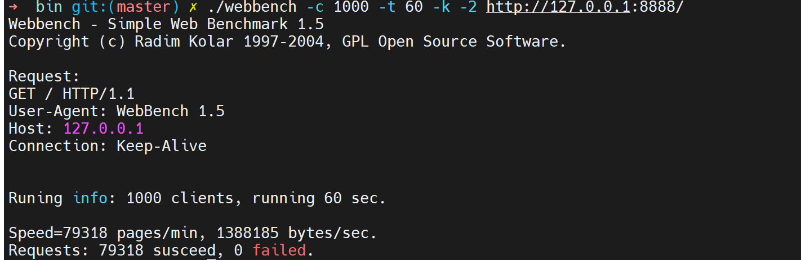

# TcpServer
### 基于Reactor模型多线程C++ Web服务器

1.实现channel类根据事件注册回调函数，事件驱动，有响应事件触发回调函数；

2.抽象连接类Connection,继承实现Httpconn类；

3.采用主从Reactor模式，一个mainReactor，多subReactor，mainRector负责监听连接，建立连接，采用阻塞Epoll水平触发防止丢失连接，subreactor采用非阻塞Epoll边沿触发处理请求，采用round robin将每个连接均匀分配给subRector，subRector负责读写以及业务逻辑；

4.利用RAII以及单例模式实现数据库连接池；

5.日志分前后端，后端线程负责将日志写入磁盘，前端采用阻塞线程安全的队列收集日志；

6.利用状态机以及正则表达式实现Http报文解析；

7.采用智能指针防止内存泄漏；

8.利用小根堆实现连接超时定时器，每个eventloop有一个连接定时器，连接超时清除多余连接；
